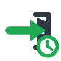
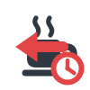

# WorkTimePunch

Nextcloud Begleit-App fuer schnelle Anwesenheits- und Pausenbuchungen in
Verbindung mit der Nextcloud App WorkTime.

WorkTimePunch ergaenzt WorkTime um kompakte Schaltflaechen in der Nextcloud
Kopfleiste. Mitarbeitende koennen damit direkt zwischen Kommen, Pause,
Pause beenden und Gehen wechseln, ohne zuerst die WorkTime Oberflaeche zu
oeffnen.

## Wichtiger Hinweis zu WorkTime

WorkTimePunch ist eine eigenstaendige Begleit-App und kein Bestandteil von
WorkTime.

Alle Rechte an WorkTime, insbesondere Urheberrechte, Markenrechte und sonstige
Schutzrechte, liegen bei den jeweiligen Inhabern des WorkTime Projekts.
WorkTimePunch erhebt keinen Anspruch auf WorkTime und ersetzt WorkTime nicht.

WorkTime wurde fuer die Nutzung von WorkTimePunch nicht veraendert. Die App
arbeitet als separate Nextcloud App neben WorkTime und nutzt die vorhandenen
WorkTime Datenstrukturen lediglich zur Erfassung der Anwesenheits- und
Pausenzustaende.

## Features

* Top-Bar-Schaltflaechen fuer Kommen, Pause starten, Pause beenden und Gehen
* Automatische Aktivierung und Deaktivierung der jeweils passenden Aktion
* Tagesbezogener Anwesenheitsstatus pro WorkTime Mitarbeiter
* Automatische Erstellung von WorkTime Zeiteintraegen fuer Arbeitsabschnitte
* Pausenstatus ohne manuelle Navigation in die WorkTime App
* Browser-Tab-uebergreifende Aktualisierung des Status
* Schutz gegen parallele oder ungueltige Buchungsaktionen
* Automatische Deaktivierung von WorkTimePunch, wenn WorkTime nicht aktiv ist

## Voraussetzungen

* Nextcloud 32+
* PHP 8.2+
* Installierte und aktivierte Nextcloud App `worktime`
* Aktiver WorkTime Mitarbeiter, der dem angemeldeten Nextcloud Benutzer
  zugeordnet ist

## Installation

```bash
# In das Nextcloud custom_apps Verzeichnis wechseln
cd /var/www/nextcloud/custom_apps

# WorkTimePunch installieren
git clone https://github.com/Bacaloo/WorkTimePunch.git worktimepunch

# Dateirechte an die Webserver-Benutzergruppe anpassen
chown -R www-data:www-data worktimepunch
```

App aktivieren:

```bash
php occ app:enable worktimepunch
php occ upgrade
```

WorkTimePunch prueft beim Laden, ob WorkTime verfuegbar ist. Ist WorkTime nicht
aktiv, deaktiviert sich WorkTimePunch selbst.

## Nutzung

Nach der Aktivierung erscheinen in der Nextcloud Kopfleiste vier Symbole:

 Kommen

 In Pause gehen

 Aus der Pause kommen

 Gehen

Die App aktiviert nur Aktionen, die zum aktuellen Zustand passen. Ein Benutzer
ohne zugeordneten aktiven WorkTime Mitarbeiter sieht keine nutzbaren
WorkTimePunch Aktionen.

## Buchungslogik

WorkTimePunch speichert den aktuellen Anwesenheitszustand in einer eigenen
Hilfstabelle. Beim Wechsel in die Pause oder beim Gehen wird aus dem offenen
Arbeitsabschnitt ein WorkTime Zeiteintrag erzeugt.

Die eigentliche Arbeitszeitverwaltung, Auswertung, Genehmigung und
Weiterverarbeitung bleibt bei WorkTime.

## Datenschutz

WorkTimePunch verarbeitet personenbezogene Arbeitszeitdaten des angemeldeten
Nextcloud Benutzers, soweit sie fuer die Anwesenheits- und Pausenbuchung
erforderlich sind.

Die App speichert den aktuellen WorkTimePunch Status je WorkTime Mitarbeiter in
einer eigenen Hilfstabelle und erzeugt beim Wechsel in die Pause oder beim
Gehen WorkTime Zeiteintraege. Dazu gehoeren insbesondere Mitarbeiterbezug,
Anwesenheitsstatus, Beginn von Arbeitsabschnitten und Beginn von Pausen.

WorkTimePunch uebertraegt diese Daten nicht an externe Dienste und stellt keine
eigene Exportfunktion bereit. Die weitere Arbeitszeitverwaltung, Auswertung,
Aufbewahrung und ein moeglicher Export erfolgen in der WorkTime App und nach
den dort geltenden Einstellungen und Verantwortlichkeiten.

Administratoren sollten WorkTimePunch nur fuer Benutzer aktivieren, die WorkTime
nutzen duerfen, und die gesetzlichen sowie betrieblichen Anforderungen zur
Arbeitszeiterfassung und zum Datenschutz beachten.

## Lizenz

AGPL-3.0

Diese Lizenz gilt fuer WorkTimePunch. WorkTime bleibt ein eigenstaendiges
Projekt unter der Lizenz und Rechtezuordnung des jeweiligen WorkTime Inhabers.
